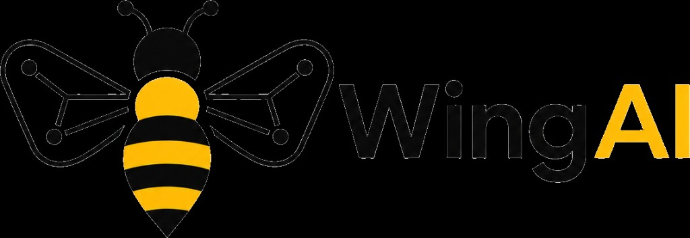
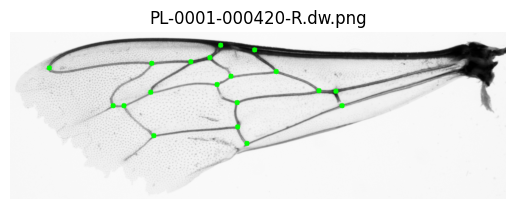

<p align="center">
  <picture>
    <source media="(prefers-color-scheme: dark)" srcset="./docs/logo-dark.png">
    <source media="(prefers-color-scheme: light)" srcset="./docs/logo.png">
    
  </picture>
</p>

# WingAI – Automated Bee Wing Landmark Detection

> 🌐 **WingAI is live:** https://wingai.ii.pw.edu.pl/  
> Open the web app in your browser — no local installation required.

<a href="https://wingai.ii.pw.edu.pl/" target="_blank">
  
</a>

---

<a target="_blank" href="https://cookiecutter-data-science.drivendata.org/">
    
</a>

WingAI is an open-source software tool for fully automated detection and annotation of morphometric landmarks on bee wing images.  
The system combines a YOLO-based wing detector with a deep convolutional neural network (U-Net) for landmark localization, complemented by robust post-processing and Generalized Procrustes Analysis (GPA) to ensure biologically consistent landmark ordering.

WingAI is designed to support high-throughput morphometric analyses, reduce manual annotation effort, and integrate seamlessly with existing classification workflows such as IdentiFly.

The web application lives in a separate repository, [wingai-app](https://github.com/mkrajew/wingai-app). This repository contains the **full pipeline for dataset preprocessing, model training, and evaluation**, including all code used to prepare training data, train the neural network models, and reproduce the experimental results.



---

## Key Features

- Automatic wing detection in raw images using a trained YOLO model
- Fully automated detection of 19 homologous morphometric landmarks
- Robust landmark ordering using Generalized Procrustes Analysis (GPA)
- Batch processing of large image collections
- Interactive web-based user interface (React + FastAPI, in the separate [wingai-app](https://github.com/mkrajew/wingai-app) repository)
- Manual landmark editing and quality-control flags
- Automatic identification of potentially problematic images
- Export of landmark coordinates in:
  - CSV format compatible with training datasets
  - IdentiFly-compatible metadata format
- GPU acceleration (optional, automatic if available)

---

## Dataset

WingAI was developed and evaluated using the publicly available dataset:

**[Collection of wing images for conservation of honey bees (Apis mellifera) biodiversity in Europe](https://zenodo.org/records/7244070)**.

This dataset contains annotated bee wing images collected across Europe and serves as the primary source for training, validation, and testing of the WingAI model.


---

## Running the Application

The web application is developed and deployed from a separate repository, [wingai-app](https://github.com/mkrajew/wingai-app) (React frontend, FastAPI backend, Docker Compose). It runs on the trained checkpoint and the precomputed mean wing shape produced by this repository – see [Model Training](#model-training) below.

---

## Installation & Environment Setup

This project uses **uv** for dependency and environment management.

### Requirements

- Python 3.12
- CUDA-capable GPU (optional, recommended)

### Sync dependencies

To install the project dependencies:

```bash
uv sync
```

### Development dependencies (optional)

If you plan to work with notebooks or development tools, install the development dependencies as well:

```bash
uv sync --dev
```

---

## Performance

The computational performance of WingAI was evaluated using end-to-end benchmarks measuring the time required to process a single bee wing image, from loading the (already cropped) image file to the generation of ordered landmark coordinates: preprocessing, U-Net inference, landmark extraction and GPA ordering with the production settings (reflection handling, 8 start angles, PCA pre-alignment). Benchmarks were executed using `pytest-benchmark` (`wings/benchmarks/test_inference.py`) on standard laptop hardware. Each case runs 1000 rounds after warm-up, every round processing the next image of a fixed random sample of 100 wing images from the countries used for training (AT, GR, HR, HU, MD, PL, RO, SI).

**Test platform:**
- CPU: 12th Gen Intel® Core™ i7-12800H (2.40 GHz)
- RAM: 32 GB
- GPU: NVIDIA RTX A3000 Laptop GPU (12 GB)
- Software: Python 3.12, PyTorch 2.11 (CUDA 12.8)

The results are summarized below (`final-precise` was trained without augmentation, `final-rotation-2` with rotation augmentation over the full ±180° range; both share the same architecture):

| Model | Mode | Min (ms) | Max (ms) | Mean (ms) | StdDev (ms) | Median (ms) | Rounds |
|---|---|---|---|---|---|---|---|
| final-precise | GPU | 27.28 | 71.86 | 36.42 | 4.87 | 36.48 | 1000 |
| final-precise | CPU | 383.13 | 585.39 | 460.28 | 24.69 | 465.96 | 1000 |
| final-rotation-2 | GPU | 30.99 | 116.78 | 38.88 | 9.32 | 35.83 | 1000 |
| final-rotation-2 | CPU | 441.61 | 620.01 | 468.85 | 16.78 | 466.01 | 1000 |

With GPU acceleration enabled, WingAI processes a single image in under **40 ms** on average (about 26 images per second), while CPU-only execution takes approximately **465 ms** per image (about 2 images per second). On the CPU about 94% of the time is the U-Net forward pass (≈435 ms); on the GPU the forward pass takes ≈17–18 ms, the GPA landmark ordering ≈12–14 ms and image loading with preprocessing ≈6 ms. These results show that batch processing is practical on standard laptop hardware, with a GPU recommended for large collections.

To reproduce the measurements: `uv run pytest --benchmark-min-rounds=1000 -k full` (see the docstring of `wings/benchmarks/test_inference.py` for the options).

---

## Project structure
```text
.
├── data                # Datasets
│   ├── raw             # Raw wing images
│   ├── interim         # Intermediate processing results
│   ├── processed       # Final processed datasets
│   └── external        # External data sources
├── models              # Trained neural network weights
├── notebooks           # Research and development notebooks
├── docs                # Documentation
├── references          # Reference materials
├── reports             # Figures and analysis outputs
└── wings               # Core WingAI source code
    ├── modeling        # Model definitions and training code
    ├── dataset         # Dataset handling and GPA logic
    ├── gpa.py          # GPA logic
    ├── visualizing     # Visualization utilities
    └── utils           # Shared helper functions

```

---

## Citation

Citation will be added after publication.

---

## Model Training

The full training pipeline consists of two stages: wing detection (YOLO) and landmark localization (U-Net).

### Wing Detection – YOLO

A YOLO model was trained to automatically detect and crop bee wings from input images, providing clean, normalized inputs for the landmark localization stage.

Training labels were derived automatically from the existing landmark annotations — no manual bounding box annotation was required. For each image, the bounding box was computed by taking the minimum and maximum x/y values across all landmark coordinates. The resulting box was then expanded by a small percentage on each side to ensure the full wing region was enclosed, accounting for minor landmark placement variation near the wing boundary.

### Landmark Localization – U-Net

#### Dataset preparation

The model was trained using the dataset described above.

To train the model, unpack the downloaded dataset into: `data/raw`.

Next, preprocess the raw data into training-ready datasets. This can be done using the notebook:
`04_save_datasets.ipynb`.

After generating the datasets, compute the mean wing shape with the notebook:
`09_GPA_impl.ipynb`.

#### Run training

Once the training datasets and the mean wing shape have been prepared, configure the training parameters in the following file:

`wings/modeling/training/unet_training.py`

This includes paths to the datasets, training hyperparameters, and output directories.

After setting the desired parameters, start the training by running:

`uv run wings/modeling/training/unet_training.py`

During training, the pipeline automatically monitors validation performance and saves the best-performing model checkpoints to the `models/` directory.

After training is complete, select the appropriate checkpoint file and provide it, together with the computed mean wing shape, to the web application ([wingai-app](https://github.com/mkrajew/wingai-app), `backend/models/`).
These files are required for running inference and for correct landmark ordering.

---

---
This software was developed as part of an engineering thesis.

The author retains full copyright to the source code.  
The project is released as open-source software under the terms of the **GNU General Public License v3 (GPLv3)**.

I would like to express my sincere gratitude to my supervisor Dr. Łukasz Neumann for the valuable guidance, constructive feedback, and continuous support provided throughout the course of this work.

I would also like to thank Bartłomiej Molasa (Faculty of Biology, Jagiellonian University) and Michał R. Kolasa (Institute of Zootechnics – National Research Institute) for their substantial scientific support, expert consultations, and meaningful contributions to the design, testing, and functional evaluation of the developed system.

Their knowledge, experience, and insightful remarks played a crucial role in the successful completion of this project.
